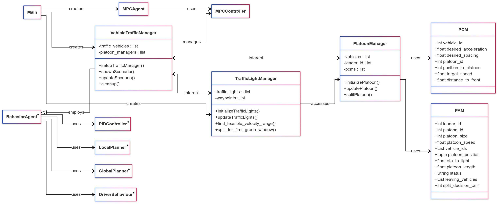

# Centralized SPaT-Driven Platooning in CARLA

## Description

This project implements and simulates a centralized decision-making framework for fuel-efficient urban vehicle platooning within the CARLA simulator. The system leverages real-time Vehicle-to-Everything (V2X) communication, specifically Signal Phase and Timing (SPaT) data, to optimize vehicle trajectories and minimize fuel consumption.

The core strategy involves a platoon leader vehicle controlled by a nonlinear Model Predictive Control (MPC) algorithm, which calculates optimal speed profiles based on upcoming traffic light phases received via SPaT. Following vehicles utilize a gap-and-velocity-based Cooperative Adaptive Cruise Control (CACC) strategy to maintain platoon cohesion.

Coordination and dynamic platoon splitting (when the entire platoon cannot pass an intersection during a green phase) are managed through simulated V2X Platoon Control Messages (PCM) and Platoon Awareness Messages (PAM).

Simulations within the CARLA environment demonstrate significant fuel savings (up to 41.2%), smoother traffic flow, reduced stops at intersections, and improved throughput compared to non-coordinated driving.

## System Architecture

The system consists of several key Python modules interacting within the CARLA environment:

* **`main.py`**: The main script to initialize the CARLA world, spawn vehicles (ego leader and followers), set up managers, and run the simulation loop.
* **`traffic_light_manager.py`**: Manages traffic light states based on SPaT data and configuration. Calculates feasible green windows and reference velocities for the leader. Implements the dynamic platoon splitting logic.
* **`traffic_manager.py`**: Spawns and manages follower vehicles and other background traffic. Configures follower behavior (e.g., using `BehaviorAgent`). Logs vehicle data to CSV files.
* **`platoon_manager.py`**: Manages the state of platoons, including creating and updating PAM/PCM messages. Handles the execution of platoon splitting based on decisions from the `TrafficLightManager`.
* **`platoon_messages.py`**: Defines the structure for PAM and PCM messages using dataclasses.
* **`mpc_agent.py`**: Controls the ego/leader vehicle using the MPC controller. Takes reference velocity from the `TrafficLightManager`.
* **`mpc_controller.py`**: Implements the nonlinear MPC using CasADi. Defines the cost function and constraints based on `config.yaml`.
* **`ego_model.py`**: Provides the kinematic bicycle model for the MPC's state prediction.
* **`pid_agent.py`**: An alternative PID-based controller for the ego vehicle.
* **`carla_components/`**: Contains basic agent behaviors, planners (local, global), and PID controllers, likely adapted from CARLA examples.
* **`camera_manager.py`, `display_manager.py`**: Utilities for setting up the CARLA camera sensor and rendering the view using Pygame.
* **`utils.py`**: Helper functions, including CSV waypoint reading and fuel consumption calculation.
* **`config.yaml`**: Configuration file for MPC parameters (horizon, timestep, weights, limits).
* **`route.csv`**: Defines the waypoints for the vehicle route.
* **`evaluate.ipynb`**: Jupyter Notebook for plotting and analyzing simulation results saved in CSV files.



## Dependencies
All dependencies are listed in `requirements.txt`. Install them with:
```bash
pip install -r requirements.txt
```

Note: The CARLA Python API must be installed separately according to the official CARLA documentation. Ensure the version matches the simulator (0.9.13).

## Setup

1.  **Install CARLA:** Follow the official CARLA documentation to install the simulator.
2.  **Install Python Dependencies:** Use the provided `requirements.txt` file:
    ```bash
    pip install -r requirements.txt
    ```
    *Note: The CARLA Python API needs to be installed separately according to the CARLA documentation.*
3.  **Clone this repository:**
    ```bash
    git clone <repository_url>
    cd EcoLead
    ```

## Configuration

1.  **Route:** Define the vehicle's route by editing the waypoints in `route.csv`. Each row should represent a waypoint with columns `x,y,z,pitch,yaw,roll`.
2.  **MPC Parameters:** Adjust the MPC settings (prediction horizon `N`, time step `dt`, cost function weights, actuator limits) in `config.yaml`.
3.  **Traffic Lights:** Configure the traffic lights to be used, their initial states, and cycle timings within the `traffic_lights_settings` dictionary in `main.py`. Ensure the IDs match the traffic lights in your chosen CARLA map.
4.  **Scenario Settings:** Modify scenario parameters (scenario type, follower behavior, ego controller type, number of followers, spacing) directly in `main.py`.

## Running the Simulation

1.  Start the CARLA simulator server.
2.  Run the main script from the `src` directory:
    ```bash
    python main.py
    ```

## Evaluation

Simulation results, including vehicle velocities, positions, platoon information, and fuel consumption, are logged to CSV files. Use the `evaluate.ipynb` Jupyter Notebook to visualize and analyze these results. Ensure you have the necessary Jupyter environment and libraries (like `ipywidgets` and `seaborn`, included in `requirements.txt`) installed.

## Related Publication

This code implements the concepts described in the following paper:

* Yazgan, M., Tatar, S., & Zöllner, J. M. (Year). [Centralized Decision-Making for Platooning By Using SPaT-Driven Reference Speeds](https://arxiv.org/abs/2505.06071). [IEEE IV 2025].

## License

This project is licensed under the BSD 3-Clause License. See the [LICENSE](licences/LICENSE.txt) file for details.

## Third-Party-Licenses

- **CASadi** — GNU LGPL v3 (siehe [LICENSE_CASadi](licences/CASadi-LGPLv3.txt))
- **Pygame** — GNU LGPL 2.1 (siehe [LICENSE_PyGame](licences/PyGame-LGPL_v2.1.txt))  